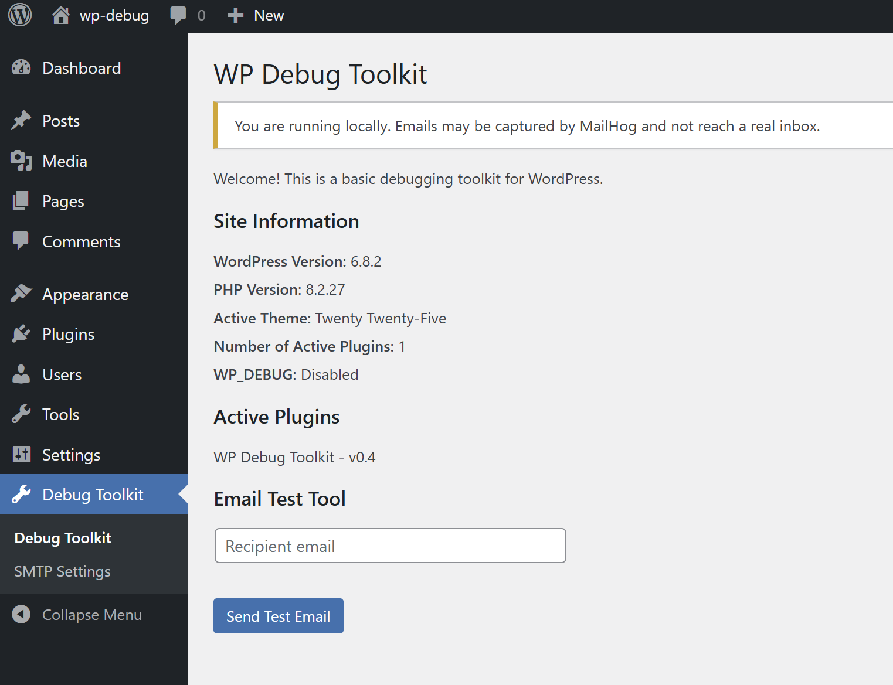
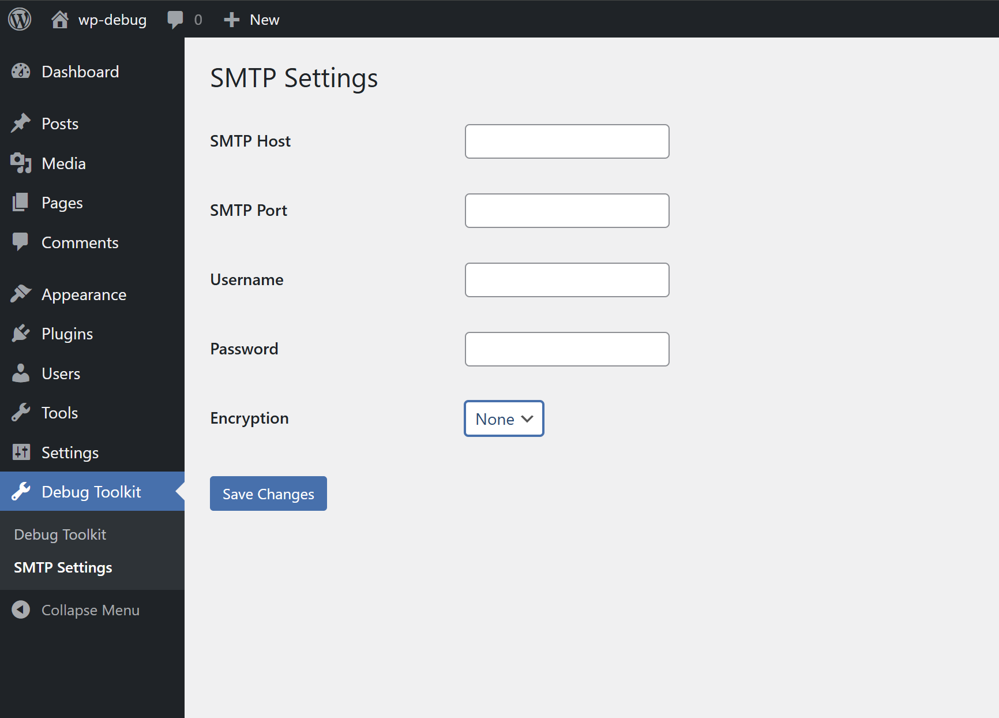

# WP Debug Toolkit

A lightweight WordPress plugin to debug your site, monitor active plugins, check WP_DEBUG status, and test email sending functionality.

## Features

- Display site information:
  - WordPress version
  - PHP version
  - Active theme
  - Active plugins
- Show WP_DEBUG status
- Email Test Tool with custom recipient
- Optional SMTP configuration for real email delivery
- Local environment warning for development (MailHog, LocalWP)

## Installation

1. Clone or download the repository.
2. Upload the `wp-debug-toolkit` folder to `/wp-content/plugins/`.
3. Activate the plugin through the WordPress admin panel.
4. Navigate to **Debug Toolkit** in the admin menu.
5. (Optional) Configure SMTP settings under **SMTP Settings**.

## Usage

- Go to **Debug Toolkit → Dashboard** to view site info and active plugins.
- Use **Email Test Tool** to send a test email to any recipient.
- Local environment warning will appear if running on `localhost` or `.local`.

## Screenshots

1. **Email Test Tool** – Send test emails to custom recipients  
   

2. **SMTP Settings** – Configure SMTP for real email delivery  
   

## Contributing

Contributions are welcome! Please fork the repository and submit a pull request.

## License

GPLv2 or later. See [GPL License](https://www.gnu.org/licenses/gpl-2.0.html)
